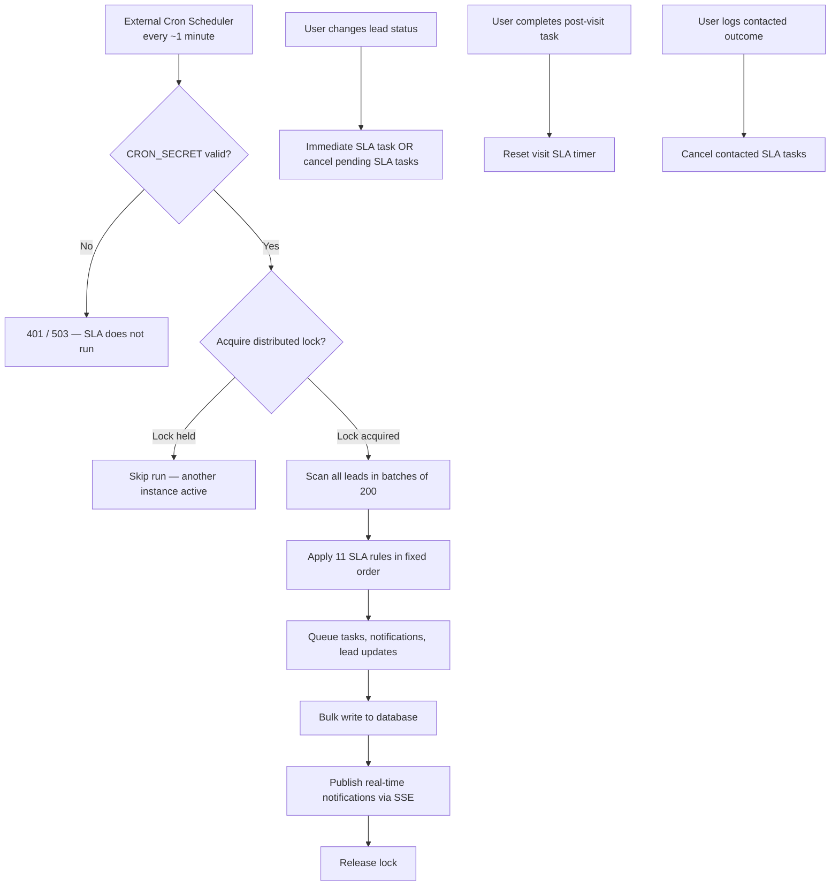

# SLA Engine — End-to-End Audit Report

**Product:** Arihant CRM  
**Document type:** Client review & sign-off  
**Version:** 1.0  
**Date:** 5 June 2026  
**Audience:** Business stakeholders, operations leads, client reviewers  

---

## Executive Summary

The SLA (Service Level Agreement) Engine is an automated follow-up and escalation system for sales leads. It runs on a scheduled background job (cron), evaluates every active lead against stage-specific timers, and then:

- Creates **tasks** for sales reps or admins  
- Sends **in-app notifications** (with real-time bell alerts)  
- **Reassigns** leads when follow-up is delayed  
- **Changes lead status** automatically when time limits are exceeded  

The engine covers **11 lead stages** with **40+ distinct SLA thresholds**. It is designed to be **idempotent** (the same rule never fires twice for the same lead) and **safe under concurrency** (only one cron instance runs at a time).

**Production dependency:** SLA rules only execute when an external scheduler calls `POST /api/v1/cron/process-slas` every minute with a valid `CRON_SECRET`. Without this, no automated SLA actions occur.

---

## Table of Contents

1. [How the system works (high level)](#1-how-the-system-works-high-level)
2. [Lead stages covered by SLA](#2-lead-stages-covered-by-sla)
3. [Business hours & time calculation](#3-business-hours--time-calculation)
4. [Complete rule-by-rule behaviour](#4-complete-rule-by-rule-behaviour)
5. [End-to-end flows ("I do X → Y happens")](#5-end-to-end-flows-i-do-x--y-happens)
6. [What users see in the application](#6-what-users-see-in-the-application)
7. [Notifications & tasks reference](#7-notifications--tasks-reference)
8. [Automatic status changes](#8-automatic-status-changes)
9. [Edge cases & known behaviours](#9-edge-cases--known-behaviours)
10. [Technical architecture (reference)](#10-technical-architecture-reference)
11. [Client review checklist — please confirm or request changes](#11-client-review-checklist--please-confirm-or-request-changes)

---

## 1. How the system works (high level)



### Two trigger paths

| Path | When | What happens |
|------|------|--------------|
| **Scheduled (cron)** | Every ~1 minute | Engine scans all eligible leads and fires overdue thresholds |
| **Immediate (user action)** | Status change, task completion, outcome logging | Tasks created or cancelled without waiting for cron |

### What SLA never touches

Leads in **terminal/closed** statuses are excluded from every SLA rule:

- Closed Won, Closed Lost, Booked, Advance Paid, Dropped, Junk, Unqualified

When a lead moves to a terminal status, the `is_rnr` flag is cleared and all pending SLA tasks are cancelled.

---

## 2. Lead stages covered by SLA

| # | Lead Status | SLA Rule Key | Included in SLA? |
|---|-------------|--------------|------------------|
| 1 | New (also Open + original status New) | `new` | Yes |
| 2 | RNR (Ring No Response) | `rnr` | Yes |
| 3 | Contacted | `contacted` | Yes |
| 4 | Nurturing (Hot / Warm temperature) | `nurturing` | Yes |
| 5 | Site Visit Scheduled | `visit_scheduled` | Yes |
| 6 | Visit Completed | `visit_completed` | Yes |
| 7 | SV Completed – Follow Up | `sv_followup` | Yes |
| 8 | Negotiation | `negotiation` | Yes |
| 9 | Gone Cold | `gone_cold` | Yes |
| 10 | Future Prospect | `future_prospect` | Yes |
| 11 | Re-engaged | `reengaged` | Yes |
| 12 | Closed Won / Closed Lost | — | **Excluded** |

---

## 3. Business hours & time calculation

### Business hours definition

| Setting | Value |
|---------|-------|
| Timezone | **Asia/Kolkata (IST)** |
| Working days | **Monday – Saturday** |
| Working hours | **10:00 AM – 5:30 PM IST** |
| Sunday | **Excluded** — timers pause |

### Which rules use business time vs calendar time?

| Timer Type | Rules Using It |
|------------|----------------|
| **Business time** (pauses nights, Sundays) | New lead 30-minute reassign; RNR 4-hour reminders |
| **Calendar time** (24/7 wall clock) | All other thresholds (2h, 24h, 48h, 72h, 7d, 15d, 30d, 90d) |

### Special intake window (New lead 2-hour admin alert)

The **2-hour admin alert** for new leads only applies to leads **created between 10:00 AM and 5:00 PM IST, Monday–Saturday**. The alert itself may fire after hours once 2 calendar hours have passed.

> **Note:** Business hours end at 5:30 PM, but the intake window ends at 5:00 PM. Leads created between 5:00–5:30 PM are excluded from the 2-hour admin alert.

### Example: 30-minute business-time reassign

| Event | Time (IST) | Business seconds elapsed |
|-------|------------|--------------------------|
| Lead created | Monday 5:20 PM | — |
| Cron runs | Monday 5:25 PM | 5 min (not yet 30 min) |
| Cron runs | Monday 5:35 PM | 10 min (outside business hours — timer paused) |
| Cron runs | Tuesday 10:20 AM | **30 business minutes reached → reassign fires** |

---

## 4. Complete rule-by-rule behaviour

Rules are processed in this **fixed order** on every cron run:

`new → rnr → contacted → nurturing → visit_scheduled → visit_completed → sv_followup → negotiation → gone_cold → future_prospect → reengaged`

---

### 4.1 NEW leads

**Who qualifies:** Status = `New`, OR status = `Open` with original status = `New`

| Threshold | Time basis | Condition | Action | Assigned to | Priority |
|-----------|------------|-----------|--------|-------------|----------|
| **30m** | Business time (30 min) | Lead still New after 30 business minutes; cron runs during business hours | **Auto-reassign** via round-robin to active agent; admin fallback if no agent eligible | New assignee | — |
| **2h** | Calendar time (2 hours) | Lead still New; created in intake window (10:00–17:00 IST Mon–Sat) | Task: **"Alert Admin"** | Admin | High |

**On status change to Contacted:** New-lead SLA flags are cleared (30m and 2h will not fire again).

---

### 4.2 RNR (Ring No Response)

**Who qualifies:** `is_rnr = true` OR status matches RNR pattern

> **Important:** The entire RNR rule only runs when cron executes **during business hours** (Mon–Sat 10:00–17:30 IST). RNR escalations do not fire on Sunday or outside business hours, even if calendar thresholds have passed.

| Threshold | Time basis | Reference timestamp | Action | Assigned to | Priority |
|-----------|------------|---------------------|--------|-------------|----------|
| **reminder_1, 2, 3…** | Business time (every 4 business hours) | `rnr_entered_at_dt` | Task: **"RNR Reminder"** | Lead assignee | Medium |
| **24h** | Calendar time | `rnr_entered_at_dt` | Task: **"RNR Escalation — Admin Review Required"** | Admin | Medium |
| **48h** | Calendar time | `rnr_entered_at_dt` | Task: **"RNR Escalation — Admin Review Required"** | Admin | Medium |
| **15d** | Calendar time (360 hours) | `rnr_entered_at_dt` | Task: **"RNR Lead — 15 Days Uncontacted — High Priority Admin Review"** | Admin | High |

---

### 4.3 CONTACTED

**Who qualifies:** Status = `Contacted`

| Threshold | Time basis | Reference timestamp | Action | Assigned to | Priority |
|-----------|------------|---------------------|--------|-------------|----------|
| **48h** | Calendar time | `contacted_at_dt` | Task: **"Follow up — log outcome for this lead"** | Lead assignee | Medium |
| **72h** | Calendar time | `contacted_at_dt` | Task: **"Admin Alert — Contacted lead unactioned 72h"** | Admin | High |

**Cancellation:** When a rep logs a valid `logged_outcome` (Interested, Not Interested, Follow-up Scheduled, Others), all pending Contacted SLA tasks are cancelled immediately.

**Valid outcomes when logging contact:**
- Interested
- Not Interested
- Follow-up Scheduled
- Others (requires reason text)

---

### 4.4 NURTURING

**Who qualifies:** Status contains "Nurturing" (Hot or Warm temperature)

| Threshold | Time basis | Condition | Action |
|-----------|------------|-----------|--------|
| **Auto Warm** | Calendar (24h) | In Nurturing with no temperature set for 24+ hours | Sets `temperature = Warm` (no task) |
| **hot_2d** | Calendar (2 days) | Temperature = Hot; within first 14 days in Nurturing | Task: **"Hot Lead Follow-up"** |
| **warm_4d** | Calendar (4 days) | Temperature = Warm; within first 14 days in Nurturing | Task: **"Warm Lead Follow-up"** |

**14-day cap:** Hot/Warm follow-up tasks stop after 14 calendar days in Nurturing.

**Separate daily job — Nurturing Review (not part of main SLA loop):**
- Runs once daily (`POST /api/v1/cron/nurturing-review`)
- Finds leads in Nurturing for 14+ days (excluding booking-progress statuses)
- Sends admin in-app notification + Brevo email digest
- Sets flag `sla_flags.nurturing.admin_review_14d_at_dt`

---

### 4.5 SITE VISIT SCHEDULED

**Who qualifies:** Status matches "Site Visit Scheduled" or "Visit Scheduled"

| Threshold | Time basis | Condition | Action | Assigned to |
|-----------|------------|-----------|--------|-------------|
| **missing_date** | Immediate | Visit scheduled but `visit_date_dt` is empty | Task: **"Missing Visit Date: Update Required"** | Lead assignee |
| **pre_24h** | Calendar | Visit date is within next 24 hours | Task: **"Send WA Reminder to Client"** | Lead assignee |
| **post_24h** | Calendar | 24+ hours after visit date; still in Visit Scheduled status; no pending Visit Completed task | Task: **"Post-Visit Follow-up"** | Lead assignee |

**Reschedule behaviour:** If visit date/time is changed, the pending pre-24h task is cancelled and the pre-24h flag is cleared so a new reminder can be scheduled.

**WhatsApp:** The pre-24h task is a **manual reminder task only**. Automatic WhatsApp sending is **disabled by design**.

**UI warning:** Lead profile shows an amber alert — *"Required — SLA reminders won't fire without this"* — when visit date is missing.

---

### 4.6 VISIT COMPLETED

**Who qualifies:** Status matches "Visit Completed"

**Reference timestamp for timers:** `visit_sla_reference_dt` (preferred) → `visit_completed_at_dt` → `updated_at_dt`

| Threshold | Time basis | Condition | Action | Assigned to | Priority |
|-----------|------------|-----------|--------|-------------|----------|
| **t0** | Immediate (on status change) | User moves lead to Visit Completed | Task: **"Post-visit follow-up — push for booking"** | Lead assignee | Medium |
| **48h** | Calendar | 48+ hours since reference timestamp | Task: **"Visit follow-up — confirm booking status"** (or reminder variant if pending task exists) | Lead assignee | Medium |
| **72h** | Calendar | 72+ hours since reference timestamp | **Reassign lead to Admin** + task: **"Visit follow-up delayed — Admin action"** + sets `follow_up_delayed = true` | Admin | High |
| **7d** | Calendar | 7+ days since reference timestamp; still Visit Completed | **Automatic status change** (see Section 8) | — | — |

**Timer reset:** When a rep completes any post-visit SLA task with a required outcome, `visit_sla_reference_dt` is reset to "now". The 48h, 72h, and 7d clocks restart from that moment.

**Required outcomes when completing post-visit tasks:**
- Interested
- Not Interested
- Follow-up Scheduled
- Call back / Reschedule
- Others (requires reason)

---

### 4.7 SV COMPLETED – FOLLOW UP

**Who qualifies:** Status matches "SV Completed – Follow Up" pattern

| Threshold | Time basis | Condition | Action | Assigned to | Priority |
|-----------|------------|-----------|--------|-------------|----------|
| **t0** | Immediate (on status change) | User or system moves lead to SV Follow Up | Task: **"SV Follow Up — confirm booking intent"** | Lead assignee | Medium |
| **72h** | Calendar | 72+ hours in SV Follow Up **AND** a pending/in-progress sv_followup task still exists | **Reassign to Admin** + task: **"SV Follow Up delayed — Admin action"** + sets `sv_followup_delayed` and `follow_up_delayed` | Admin | High |
| **7d** | Calendar | 7+ days in SV Follow Up | **Automatic status change** (see Section 8) | — | — |

> **Edge case:** If the t0 task is completed before 72 hours, the 72h admin escalation **will not fire** (requires a pending sv_followup task).

---

### 4.8 NEGOTIATION

**Who qualifies:** Status contains "Negotiation"

| Threshold | Time basis | Reference timestamp | Action | Assigned to | Priority |
|-----------|------------|---------------------|--------|-------------|----------|
| **48h** | Calendar | `negotiation_entered_at_dt` | Task: **"Negotiation follow-up"** | Lead assignee | Medium |
| **stalled_7d** | Calendar (7 days) | `negotiation_entered_at_dt` | Task: **"Negotiation stalled — review deal status"** | Lead assignee | High |
| **admin_15d** | Calendar (15 days) | `negotiation_entered_at_dt` | Task: **"Negotiation overdue — Admin review required"** | Admin | High |

---

### 4.9 GONE COLD

**Who qualifies:** Status = Gone Cold

| Threshold | Time basis | Reference timestamp | Action | Assigned to |
|-----------|------------|---------------------|--------|-------------|
| **30d** | Calendar (30 days) | `gone_cold_entered_at_dt` | Task: **"Re-evaluate - re-engage or close"** | Lead assignee |

**Re-entry:** Moving a lead back to Gone Cold clears the 30-day flag, allowing the rule to fire again after another 30 days.

---

### 4.10 FUTURE PROSPECT

**Who qualifies:** Status = Future Prospect

| Threshold | Time basis | Reference timestamp | Action | Assigned to | Priority |
|-----------|------------|---------------------|--------|-------------|----------|
| **90d** | Calendar (90 days) | `fp_last_checkin_task_created_at_dt` or `future_prospect_entered_at_dt` | Task: **"90-day check-in"**; increments cycle counter | Lead assignee | Medium |
| **manager_review** | Same 90d cycle when cycle ≥ 3 | — | Task: **"Manager review (3 cycles reached)"** | **Admin** (not Manager role) | High |

---

### 4.11 RE-ENGAGED

**Who qualifies:** Status = Re-engaged

| Threshold | Time basis | Reference timestamp | Action | Assigned to | Priority |
|-----------|------------|---------------------|--------|-------------|----------|
| **t0** | Immediate (on status change) | User moves lead to Re-engaged | Task: **"Re-engaged lead — qualify intent"** | Lead assignee | Medium |
| **12h** | Calendar | `reengaged_at_dt` | Task: **"Re-engaged — follow up required"** | Lead assignee | Medium |
| **24h** | Calendar | `reengaged_at_dt` | Task: **"Re-engaged escalation"** | Lead assignee | High |
| **48h** | Calendar | `reengaged_at_dt` | Task: **"Re-engaged — Admin alert"** + **automatic move to Gone Cold** | Admin | High |

**Re-entry:** Moving a lead to Re-engaged again clears all `sla_flags.reengaged`, allowing timers to restart.

---

## 5. End-to-end flows ("I do X → Y happens")

### Flow A: New lead lifecycle

```
1. Lead arrives (status: New, assigned to Rep A)
   └─ Timestamp recorded: created_at_dt

2. [After 30 business minutes, still New, during business hours]
   └─ SLA auto-reassigns to next active agent (round-robin)
   └─ Rep B gets "New Lead Assigned" notification
   └─ Flag set: sla_flags.new.reassign_30m_at_dt

3. [After 2 calendar hours, still New, created in intake window]
   └─ Admin gets task: "Alert Admin" (high priority)
   └─ Admin gets in-app notification
   └─ Flag set: sla_flags.new.alert_admin_2h_at_dt

4. Rep changes status to Contacted
   └─ ALL pending SLA tasks for this lead are cancelled
   └─ New-lead SLA flags are cleared
   └─ contacted_at_dt is set
   └─ Contacted SLA timers begin (48h, 72h)
```

---

### Flow B: Contacted → outcome logged

```
1. Lead in Contacted for 48+ hours with no outcome
   └─ Rep gets task: "Follow up — log outcome for this lead"

2. Lead in Contacted for 72+ hours
   └─ Admin gets task: "Admin Alert — Contacted lead unactioned 72h"

3. Rep logs outcome = "Interested"
   └─ Pending Contacted SLA tasks cancelled immediately
   └─ No further Contacted SLA actions until re-entry to Contacted
```

---

### Flow C: Site visit → booking push

```
1. Rep sets status to Site Visit Scheduled
   └─ If visit date missing → task: "Missing Visit Date: Update Required"

2. Rep adds visit date = tomorrow 11:00 AM
   └─ When within 24h of visit → task: "Send WA Reminder to Client"
   └─ (Rep must manually send WhatsApp — auto-send disabled)

3. Visit happens; Rep changes status to Visit Completed
   └─ visit_completed_at_dt and visit_sla_reference_dt set
   └─ Immediate task (t0): "Post-visit follow-up — push for booking"
   └─ All other pending SLA tasks cancelled (status change policy)

4. [48 hours later, no booking]
   └─ Task: "Visit follow-up — confirm booking status"

5. [72 hours later, still no booking]
   └─ Lead reassigned to Admin
   └─ follow_up_delayed = true
   └─ Admin task: "Visit follow-up delayed — Admin action"

6. Rep completes post-visit task with outcome "Follow-up Scheduled"
   └─ visit_sla_reference_dt reset to NOW
   └─ 48h/72h/7d clocks restart from this moment
   └─ Other pending visit_completed SLA tasks cancelled

7. [7 days after reference timestamp, still Visit Completed]
   └─ AUTOMATIC status change (see Section 8)
```

---

### Flow D: RNR escalation ladder

```
1. Lead marked RNR (rnr_entered_at_dt set)

2. [Every 4 business hours while still RNR, during business hours]
   └─ Rep gets "RNR Reminder" task (bucket 1, 2, 3…)

3. [24 calendar hours in RNR]
   └─ Admin gets "RNR Escalation — Admin Review Required"

4. [48 calendar hours in RNR]
   └─ Admin gets second escalation task

5. [15 calendar days in RNR]
   └─ Admin gets high-priority "15 Days Uncontacted" task
```

---

### Flow E: Re-engaged → Gone Cold auto-close

```
1. Lead moved to Re-engaged
   └─ Immediate task: "Re-engaged lead — qualify intent"
   └─ reengaged_at_dt set; prior reengaged flags cleared

2. [12 hours] → Rep task: "Re-engaged — follow up required"
3. [24 hours] → Rep task: "Re-engaged escalation" (high)
4. [48 hours] → Admin task: "Re-engaged — Admin alert"
              → Lead status AUTOMATICALLY changed to Gone Cold
```

---

### Flow F: Any status change (global policy)

```
User changes lead status from Stage A → Stage B
   │
   ├─ ALL pending SLA tasks for this lead → status: cancelled
   │
   ├─ Stage-entry timestamps set (first time only):
   │     RNR → rnr_entered_at_dt
   │     Contacted → contacted_at_dt
   │     Visit Completed → visit_completed_at_dt + visit_sla_reference_dt
   │     SV Follow Up → sv_followup_entered_at_dt
   │     Negotiation → negotiation_entered_at_dt
   │     Gone Cold → gone_cold_entered_at_dt
   │     Future Prospect → future_prospect_entered_at_dt
   │     Re-engaged → reengaged_at_dt
   │     Nurturing → nurture_entered_at_dt
   │
   └─ Immediate SLA tasks created (if applicable):
         Visit Completed → t0 post-visit task
         SV Follow Up → t0 follow-up task
         Re-engaged → t0 qualify-intent task
```

---

## 6. What users see in the application

### Tasks (My Dashboard, Lead Tasks drawer)

| Element | Description |
|---------|-------------|
| **Gold SLA badge** | Shown when `task.source = sla` |
| **Rule · Threshold chip** | e.g. `VISIT_COMPLETED · 48h` in task detail modal |
| **Task reason** | Human-readable explanation, e.g. *"Site visit completed 48+ hours ago — push for booking"* |
| **Due badges** | Overdue / Due Today / Upcoming (based on calendar due date) |
| **Outcome required** | Post-visit SLA tasks require outcome selection before completion |

### Lead profile

| Element | Description |
|---------|-------------|
| **Visit date warning** | Amber alert on Site Visit Scheduled leads missing visit date/time |
| **Status & temperature** | Standard fields; SLA does not show countdown timers on lead cards |

### Notifications (bell icon)

| Element | Description |
|---------|-------------|
| **SLA notifications** | Title format: `SLA: {task description}`; message includes due date |
| **Overdue badge** | Red "Overdue" on notifications past their SLA window |
| **Unread count** | Red badge on bell; separate smaller badge for overdue unread |
| **Click action** | Opens linked lead profile |

### What is NOT shown in the UI

- `follow_up_delayed` / `sv_followup_delayed` flags  
- Internal `sla_flags` timestamps  
- Admin reassignment reason codes  
- SLA countdown timers on dashboard lead cards  

---

## 7. Notifications & tasks reference

### Notification types

| Type | Recipient | When |
|------|-----------|------|
| `sla_task` + `action_required` | Task assignee (rep) | SLA creates a task for the rep |
| `sla_task` + `escalation` | Admin | SLA creates an escalated task |
| `sla_alert` + `escalation` | Admin | SLA changes lead status without creating a task |

### Audit trail

Every SLA action is logged in `lead_events` with:
- `event_type: sla_action`
- `actor_name: SLA Engine`
- Payload includes rule, threshold, task ID, and action type

---

## 8. Automatic status changes

These are the **only** status changes the SLA engine makes without user action:

| From Status | After | Condition | New Status | Side Effects |
|-------------|-------|-----------|------------|--------------|
| Visit Completed | 7 days | Still Visit Completed | **SV Completed – Follow Up** OR **Nurturing (Warm)** | Creates t0 SV Follow Up task; admin notification |
| SV Follow Up | 7 days | Still SV Follow Up | **Gone Cold** OR **Nurturing (Warm)** | Admin notification |
| Re-engaged | 48 hours | Still Re-engaged | **Gone Cold** | Admin task + admin notification |
| Nurturing | 24 hours | No temperature set | Temperature set to **Warm** (status unchanged) | — |

### Booking-progress branching (7-day rules)

At the 7-day mark for Visit Completed and SV Follow Up, the engine checks `is_booking_progress_status()`:

**Statuses considered "booking progress":** Negotiation, Advance, Booked, Token, Closed Won, Won

| Current stage | Booking progress detected? | 7-day outcome |
|---------------|---------------------------|---------------|
| Visit Completed | Yes → Nurturing (Warm) | No → SV Follow Up |
| SV Follow Up | Yes → Nurturing (Warm) | No → Gone Cold |

> **Please review:** With the current implementation, `is_booking_progress_status()` is evaluated against the lead's **current status string**. A lead in "Visit Completed" or "SV Completed – Follow Up" will typically **not** match booking-progress patterns. In practice, the 7-day branch may **always** take the non-booking-progress path unless status text includes negotiation-related keywords. **Confirm with client whether this is intended** or whether booking progress should be detected differently (e.g. from pipeline fields or context updates).

---

## 9. Edge cases & known behaviours

### Critical operational

| # | Edge Case | Current Behaviour | Risk |
|---|-----------|-------------------|------|
| 1 | **Cron not configured** | `backend/vercel.json` has no cron schedules in repo; SLA inactive without external scheduler | No SLA actions in production |
| 2 | **CRON_SECRET missing** | Endpoint returns 503; SLA does not run | Same as above |
| 3 | **No assignee on lead** | Task creation skipped silently (`skipped_no_assignee` in logs) | SLA action lost with no notification |
| 4 | **No admin user in system** | Admin escalations and reassignments fail silently | Escalation chain breaks |

### Timing & scheduling

| # | Edge Case | Current Behaviour |
|---|-----------|-------------------|
| 5 | **RNR rule outside business hours** | Entire RNR processing skipped on Sunday and outside 10:00–17:30 IST |
| 6 | **RNR reminder bucket skip** | If cron is down for 12 business hours, only latest bucket fires (e.g. reminder_3), not intermediate reminders |
| 7 | **Missing stage timestamp** | Falls back to `updated_at_dt` — unrelated edits can accidentally satisfy or reset SLA conditions |
| 8 | **Business vs calendar mismatch** | Notification "Overdue" badges use calendar time; New 30m and RNR reminders use business time — badges may disagree with actual SLA logic |
| 9 | **Intake window vs business hours** | 2h admin alert intake ends 17:00; business hours end 17:30 — 30-minute gap |

### Status & task interactions

| # | Edge Case | Current Behaviour |
|---|-----------|-------------------|
| 10 | **Any status change** | Cancels ALL pending SLA tasks for lead (intentional ghost-job cleanup) |
| 11 | **SV Follow Up 72h** | Only fires if pending/in-progress sv_followup task exists — completing t0 early skips 72h admin escalation |
| 12 | **Visit scheduled post_24h** | Skipped if pending visit_completed SLA task exists OR status already matches visit completed |
| 13 | **Re-engaged 48h** | Creates admin task AND moves to Gone Cold in same cron pass |
| 14 | **Re-entry to stage** | Re-engaged and Gone Cold clear prior flags — rules can fire again |
| 15 | **Terminal status transition** | Clears `is_rnr`; cancels all pending SLA tasks |

### Data & implementation gaps

| # | Edge Case | Current Behaviour |
|---|-----------|-------------------|
| 16 | **`has_meaningful_contact_since()`** | Function exists but is **never called** — Contacted/Nurturing rules do not check actual call/WhatsApp/meeting activity |
| 17 | **Manager role** | Loaded by engine but **never used** — "Manager review" tasks go to Admin |
| 18 | **WhatsApp auto-send** | Disabled — pre-24h creates manual task only |
| 19 | **Bulk write partial failure** | Errors logged; partial inserts may occur; no retry queue |
| 20 | **Nurturing 14d follow-ups** | Hot/Warm tasks stop at 14 days; separate daily nurturing-review handles 14d+ admin alert |

### UI gaps

| # | Edge Case | Current Behaviour |
|---|-----------|-------------------|
| 21 | **My Dashboard TaskCard** | No SLA badge (badge only in Lead Tasks drawer / Task Detail modal) |
| 22 | **Notification icons** | SLA notifications use generic alert icon — not visually distinct from other alerts |
| 23 | **Delayed follow-up flags** | `follow_up_delayed` / `sv_followup_delayed` not shown in UI |

---

## 10. Technical architecture (reference)

### Cron endpoints

| Endpoint | Schedule (documented) | Purpose |
|----------|----------------------|---------|
| `POST /api/v1/cron/process-slas` | Every 1 minute | Main SLA engine |
| `POST /api/v1/cron/nurturing-review` | Daily 03:30 UTC | 14-day Nurturing admin batch + email |

**Authentication:** `Authorization: Bearer <CRON_SECRET>`

### Idempotency

Each fired threshold sets a flag on the lead (`sla_flags.{rule}.{threshold}_at_dt`) and uses a unique `dedupe_key` on tasks and notifications. The same action cannot fire twice for the same lead.

### Concurrency

Distributed lock in `cron_locks` collection:
- Job name: `process_slas`
- TTL: 4 minutes
- If lock held → run skipped with `{ skipped: true, reason: "lock_held" }`

### Lead scanning

- Cursor pagination, 200 leads per batch
- Stable sort on MongoDB `_id`

### Environment variables

| Variable | Required for SLA? | Purpose |
|----------|-------------------|---------|
| `CRON_SECRET` | **Yes** | Cron authentication |
| `MONGO_URL`, `DB_NAME` | **Yes** | Database |
| SLA thresholds | — | **Hardcoded** — not configurable via env |

### Data maintenance

Script available: `backend/scripts/purge_sla_data.py`
- `--dry-run` — preview without changes
- `--revert-lead-mutations` — undo SLA-driven status changes
- `--since` / `--until` — date range filter

---

## 11. Client review checklist — please confirm or request changes

Please review each section below. For any item, mark **Confirm**, **Change**, or **Discuss**, and add your preferred behaviour in the notes column.

### A. Timing & business rules

| # | Current Behaviour | Confirm? | Your preferred behaviour (if different) |
|---|-------------------|----------|----------------------------------------|
| A1 | Business hours: Mon–Sat 10:00–17:30 IST for New 30m reassign and RNR reminders | ☐ | |
| A2 | All other timers use 24/7 calendar time | ☐ | |
| A3 | New 2h admin alert only for leads created 10:00–17:00 IST Mon–Sat | ☐ | |
| A4 | RNR entire rule skipped outside business hours (including 24h/48h/15d escalations) | ☐ | |
| A5 | Sunday excluded from all business-time calculations | ☐ | |

### B. Escalation & assignment

| # | Current Behaviour | Confirm? | Your preferred behaviour (if different) |
|---|-------------------|----------|----------------------------------------|
| B1 | New 30m: round-robin to active agents; admin fallback | ☐ | |
| B2 | Visit Completed 72h: reassign to admin | ☐ | |
| B3 | SV Follow Up 72h: reassign to admin (only if pending task exists) | ☐ | |
| B4 | All admin escalations go to first Admin user (not Manager) | ☐ | |
| B5 | "Manager review" at Future Prospect cycle 3 goes to Admin, not Manager | ☐ | |
| B6 | No assignee on lead = SLA action silently skipped | ☐ | |

### C. Automatic status changes

| # | Current Behaviour | Confirm? | Your preferred behaviour (if different) |
|---|-------------------|----------|----------------------------------------|
| C1 | Visit Completed +7d → SV Follow Up (default path) | ☐ | |
| C2 | Visit Completed +7d → Nurturing Warm (if booking progress detected) | ☐ | |
| C3 | SV Follow Up +7d → Gone Cold (default path) | ☐ | |
| C4 | SV Follow Up +7d → Nurturing Warm (if booking progress detected) | ☐ | |
| C5 | Re-engaged +48h → automatic Gone Cold | ☐ | |
| C6 | Nurturing +24h no temperature → auto-set Warm | ☐ | |

### D. Task & notification behaviour

| # | Current Behaviour | Confirm? | Your preferred behaviour (if different) |
|---|-------------------|----------|----------------------------------------|
| D1 | Any status change cancels ALL pending SLA tasks for that lead | ☐ | |
| D2 | Logging contacted outcome cancels Contacted SLA tasks | ☐ | |
| D3 | Completing post-visit task resets 48h/72h/7d visit timers | ☐ | |
| D4 | Post-visit task completion requires outcome selection | ☐ | |
| D5 | WhatsApp pre-24h reminder is manual task only (no auto-send) | ☐ | |
| D6 | Notification overdue badges use calendar time (not business time) | ☐ | |

### E. Threshold values (all hardcoded today)

| Stage | Thresholds | Confirm? | Your preferred values (if different) |
|-------|------------|----------|--------------------------------------|
| New | 30m reassign, 2h admin alert | ☐ | |
| RNR | 4h reminders, 24h/48h/15d escalations | ☐ | |
| Contacted | 48h rep, 72h admin | ☐ | |
| Nurturing | 24h auto-warm, Hot 2d, Warm 4d, 14d cap | ☐ | |
| Visit Scheduled | missing date, pre-24h, post-24h | ☐ | |
| Visit Completed | t0, 48h, 72h, 7d | ☐ | |
| SV Follow Up | t0, 72h, 7d | ☐ | |
| Negotiation | 48h, 7d stalled, 15d admin | ☐ | |
| Gone Cold | 30d re-evaluate | ☐ | |
| Future Prospect | 90d check-in, manager review at cycle 3 | ☐ | |
| Re-engaged | t0, 12h, 24h, 48h (+ Gone Cold) | ☐ | |

### F. UI & visibility

| # | Current Behaviour | Confirm? | Your preferred behaviour (if different) |
|---|-------------------|----------|----------------------------------------|
| F1 | SLA shown via tasks and notifications only (no lead-card SLA timer) | ☐ | |
| F2 | `follow_up_delayed` flag not visible in UI | ☐ | |
| F3 | Visit date missing shows amber warning on lead profile | ☐ | |
| F4 | SLA badge on tasks in drawer/detail only (not My Dashboard TaskCard) | ☐ | |

### G. Production & operations

| # | Current Behaviour | Confirm? | Your preferred behaviour (if different) |
|---|-------------------|----------|----------------------------------------|
| G1 | Cron must run every ~1 minute with CRON_SECRET | ☐ | |
| G2 | Nurturing review runs daily at 03:30 UTC | ☐ | |
| G3 | SLA thresholds not configurable without code change | ☐ | |
| G4 | Should meaningful contact activity (calls, WhatsApp) pause Contacted/Nurturing timers? (Currently: **No**) | ☐ | |

### H. Open questions for discussion

1. **Booking-progress 7-day branch:** Should "booking progress" be detected from pipeline fields, notes, or status history — rather than current status text alone?

2. **RNR Sunday behaviour:** Should 24h/48h/15d RNR escalations fire on Sunday even though the rule currently skips entirely outside business hours?

3. **Manager vs Admin escalations:** Should Manager role receive any SLA escalations (negotiation, future prospect, visit delayed)?

4. **Configurable thresholds:** Do you need admin UI or env-based configuration for SLA timers?

5. **SLA visibility:** Do you want countdown timers or SLA status indicators on lead cards / dashboards?

6. **Silent skip on no assignee:** Should the system alert admin when a lead has no assignee and an SLA action cannot fire?

7. **Contact activity integration:** Should logging a call/WhatsApp/meeting reset Contacted or Nurturing SLA timers?

---

## Document sign-off

| Role | Name | Signature | Date |
|------|------|-----------|------|
| Client reviewer | | | |
| Product owner | | | |
| Technical lead | | | |

---

*This document reflects the SLA engine as implemented in the Arihant CRM codebase as of 5 June 2026. Behaviour is derived from `sla_engine.py`, `sla_helpers.py`, `lead_service.py`, `notification_service.py`, `business_time.py`, and associated tests.*
